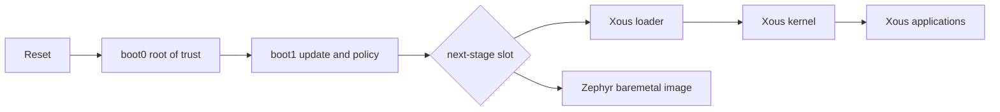

# Bring-up architecture

## Boot and update domains

Baochip 1x has a signed chain with deliberately separate update domains:

| Region | Address | Role | Update path |
|---|---:|---|---|
| boot0 | `0x60000000` | Immutable root of trust | Not field-updatable |
| boot1 | `0x60020000` | Signature policy, lifecycle, USB MSC/CDC, UART REPL | Separate `ALTCHIP` flow; out of scope for Zephyr bring-up |
| loader / baremetal | `0x60060000` | Shared next-stage slot | `BAOCHIP` |
| Zephyr entry | `0x60060400` | Entry after signature block and trampolines | Packed into the baremetal image |
| Xous kernel | signature near `0x6009fd00` | Kernel image retained when only the loader slot changes | `BAOCHIP` |
| Xous applications | signature near `0x602ffd00` | Dabao application image | `BAOCHIP` |
| Zephyr ACRAM | `0x61000000` | Runtime SRAM | Initialized at boot |

`loader.uf2` is functionally a boot2-like stage, but Xous calls it the loader
or next stage. A Zephyr baremetal UF2 replaces that same slot. It does not
overwrite boot0, boot1, or the existing Xous kernel and application regions.
Restoring a compatible Xous loader can make those retained regions usable
again; a matched loader/kernel/apps set is safer than assuming cross-version
compatibility.

Normal bring-up never writes `ALTCHIP`. Boot1 recovery is a different operation
with a materially larger failure domain.

## Signed image contract

Boot1 does not execute a generic Zephyr UF2. The installable artifact contains:

1. Baochip's signed-image header at `0x60060000`;
2. the signature-block jump and presign trampoline;
3. Zephyr's flattened ROM load image, including initialized `.data`; and
4. canonical UF2 blocks carrying Baochip family ID `0xa7d76373`.

The image must be packed and signed with `bao-image`. A generic
`build/zephyr/zephyr.uf2` lacks the signature envelope and trampolines.

The current developer signer uses next-stage key slot 3 and anti-rollback value
1. The first accepted developer-key image invokes boot1's erase policy, erases
protected factory secrets, and advances the one-way developer-mode state. This
is automatic; there is no provisioning command to run first.

## Boot1 transports

Boot1 offers three front ends while it owns the machine:

| Transport | Physical path | Function |
|---|---|---|
| USB MSC | USB-C | Synthetic FAT volume `BAOCHIP`; addressed UF2 writes |
| USB CDC-ACM | USB-C | Boot1 command REPL and serial UF2 protocol |
| UDMA UART2 | PB14 TX, PB13 RX, 1,000,000 baud 8N1 | The same REPL when USB does not own the console |

USB CDC and UART2 are transports for one REPL, not the same pins. The USB-C
connector uses dedicated `USB_D+`/`USB_D-`; PB13/PB14 are exposed UART pins.

Stock boot1 can acknowledge a serial UF2 block with `Wrote` even when RRAM
persistence failed, because its write error is printed only through the
unconnected DUART diagnostic path. A post-write `audit` and an actual boot are
therefore mandatory regardless of transport.

## USB handoff

The physical USB connection is designed for next-stage reuse. At the exact
boot1 revision observed on `S2NM5B`, boot1:

1. stops the Corigine USB controller;
2. disables its interrupts and abandons boot1's descriptor queues;
3. drives Dabao PC13 low to force USB SE0 and a host-visible disconnect; and
4. validates and jumps to the next stage.

This is a clean disconnect/re-enumeration contract, not continuity of boot1's
CDC session. The next stage must restore PC13, allocate fresh controller
contexts and rings, initialize the controller, and enumerate as a new device.

Xous's USB-enabled baremetal target demonstrates the receiving side: it
releases SE0, initializes and starts the controller, then exposes a fresh USB
CDC REPL. See the pinned Xous
[`boot1` shutdown](https://github.com/betrusted-io/xous-core/blob/5397e1b488c081566cef2c0e597e05426f67c1c3/bao1x-boot/boot1/src/main.rs#L377-L422)
and
[`baremetal` initialization](https://github.com/betrusted-io/xous-core/blob/5397e1b488c081566cef2c0e597e05426f67c1c3/baremetal/src/platform/bao1x/usb/glue.rs#L13-L75).

The current Zephyr port has no Baochip UDC driver, so it cannot yet receive
this handoff. The durable target is a proper Zephyr next-generation UDC driver
and stock CDC-ACM class, not a private byte-console shim. Initial scope should
preserve UART2 as the default/recovery console while an explicit CDC build
proves USB enumeration and bidirectional traffic.

## Current Zephyr ownership

The implementation currently lives in `~/src/zephyr-baochip` and selects:

- XIP from the baremetal RRAM window;
- ACRAM as SRAM;
- polling UDMA UART2 as the physical board console;
- the flattened Baochip irqarray interrupt controller; and
- the Baochip ticktimer as system clock.

Boot1 leaves useful machine state, but each Zephyr driver must adopt it
deliberately:

| Resource | Handoff condition | Zephyr responsibility |
|---|---|---|
| UART2 | Pinmux, clock, DMA, and events may be live | Quiesce only UART2 state, preserve unrelated UDMA resources |
| USB | Controller stopped, PC13 forced low, old rings invalid | Allocate owned IFRAM, initialize fresh state, release SE0 deliberately |
| Interrupts | CPU IRQs masked; peripheral pending state may remain | Clear peripheral cause before irqarray level post-ack |
| Ticktimer | Always-on domain may be running with inherited configuration | Establish bounded takeover and measured cadence |
| IFRAM | Boot1 used multiple fixed regions | Use explicit non-overlapping reservations; never treat all IFRAM as scratch |

The dedicated DUART is useful in Verilator but its package pad is unconnected
on Dabao. The board has no user LED. Until USB CDC works in Zephyr, PB14/PB13
are the only decisive physical text console.

## Recovery model

Holding `PROG` across USB power-up re-enters boot1 even when the next-stage
image is silent or faulty. Successful recovery means USB `1d50:6196`, boot1
CDC, and the `BAOCHIP` volume return.

Installed boot1 has no production loader-slot readback command. Its MSC is a
synthetic update disk, not a view of RRAM, and production JTAG is fused off.
Recovery therefore means obtaining or rebuilding a compatible signed Xous
image, not backing up the installed loader bytes.

Same-batch boards can preserve the factory beta-signed reference state. Once a
board has entered developer mode, a locally built dev-signed matched Xous
loader/kernel/apps set is a practical recovery path. Neither path requires or
justifies changing boot1.

## Cross-references

- [`procedure.md`](procedure.md) applies these boundaries as operator gates.
- [`s2nm5b-baseline.md`](s2nm5b-baseline.md) records the first observed hardware
  state without claiming that any image was written.
- [`../research/05-lifecycle-delivery-validation.md`](../research/05-lifecycle-delivery-validation.md)
  provides the lifecycle and transport source analysis.
- [`../research/08-device-creation-reform.md`](../research/08-device-creation-reform.md)
  defines the provider and memory-ownership model needed by USB, UART, GPIO,
  clocks, and interrupts.
