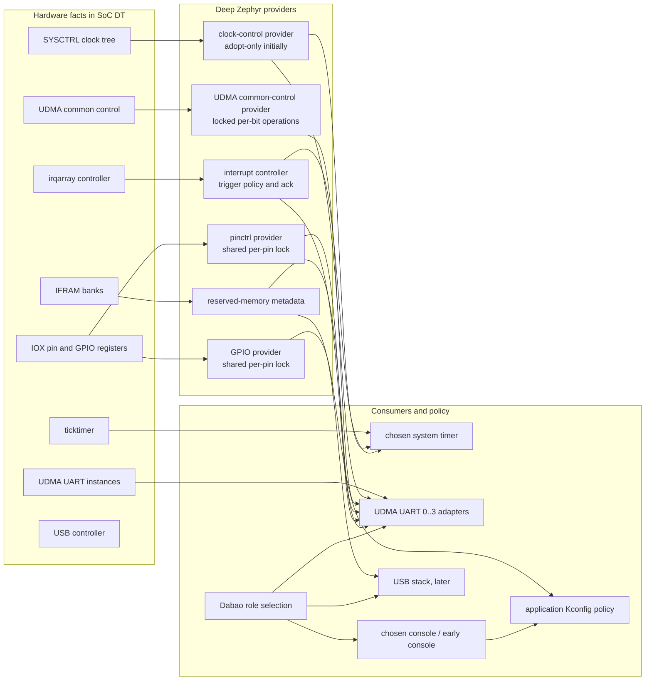
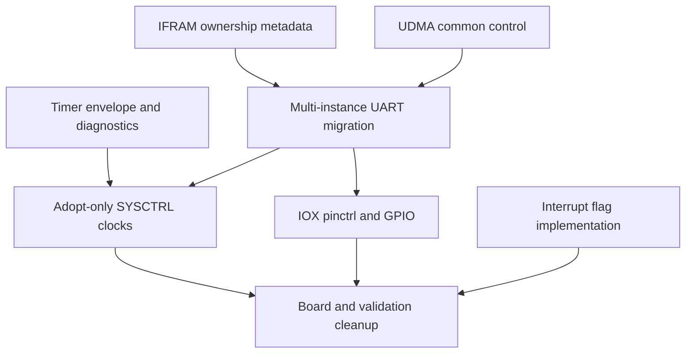

# Baochip Zephyr device creation reform

## Decision

Reform the port incrementally around deep, standard Zephyr provider/consumer
interfaces. Devicetree describes hardware facts and wiring; the board selects
roles through `chosen`, aliases, and enabled nodes; standard Kconfig expresses
application policy; implementation tuning remains private to drivers unless a
real deployment choice requires configuration.

The first infrastructure change must not be a temporary fixed-clock layer.
Introduce the final-shape SYSCTRL clock provider only when consumers are ready
to use it. Its initial implementation is **adopt-only**: report inherited rates
and state, but never change PLLs, dividers, gates, or resets. The same ownership
discipline applies elsewhere: shared providers perform narrow locked operations;
consumers do not map another device's registers or globally reinitialize shared
hardware.

This is a compatibility-preserving migration, not permission to reclaim all
resources at boot. Early console continuity and boot1's USB, IFRAM, and PC13/SE0
state remain explicit constraints.

## Design choices

| Option | Shape | Strengths | Failures | Decision |
|---|---|---|---|---|
| Flat cross-device phandles | UART and other consumers receive raw SYSCTRL, UDMA control, irqarray, and IFRAM register regions | Small immediate diff | Leaks register layout and lock policy into every consumer; hard-codes instances; permits destructive global writes; DT describes software reachability rather than hardware | Reject |
| Monolithic Baochip resource manager | One custom device owns clocks, resets, pins, UDMA, memory, and interrupts | Centralizes serialization | Recreates standard Zephyr subsystems behind a bespoke API, becomes a shallow dependency hub, and makes upstream review and independent testing harder | Reject |
| Incremental standard providers | Clock control, pinctrl, GPIO, interrupt controller, reserved memory metadata, UDMA common control, and UART use their standard or narrow domain interfaces | Ownership is reviewable; consumers become multi-instance; schemas express topology; providers can deepen without changing consumers | Requires careful migration order and preservation of inherited state | **Recommend** |

The recommendation does not require all providers at once. Each domain should
land only when it has a final-shape interface and a consumer, with temporary
cross-device mappings removed in the same domain's sequence.

## Provider and consumer topology



The graph is deliberately not a universal dependency DAG. Reserved-memory
nodes declare static ownership; they are not an allocator service. Pinctrl and
GPIO share one implementation lock for overlapping IOX per-pin fields rather
than pretending that their register ownership is disjoint.

## Ranked audit findings

1. **Critical: cross-device UART ownership is encoded as raw register regions.**
   `dts/riscv/baochip/bao1x.dtsi` gives `uart2` the UART, final IFRAM page,
   UDMA common-control, and irqarray bank regions. The binding requires all four,
   so the schema institutionalizes access that belongs behind providers.
2. **Critical: UART initialization can disturb unrelated clients.**
   `drivers/serial/uart_baochip_udma.c` performs unlocked read-modify-write on
   the shared clock-gate and irqarray enable registers. Its hard-coded
   `UDMA_UART2_CLOCK` and `IRQARRAY_UART2_EVENTS` masks make the generated
   multi-instance device declarations misleading.
3. **High: hardware handoff is implicit.** Clock rates, PB13/PB14 muxing, UDMA
   state, and console operation are inherited from boot1. The current tree has
   no clock or pinctrl provider and therefore cannot state whether a driver is
   observing, adopting, or changing that state.
4. **High: IFRAM ownership is not represented as memory ownership.** A UART
   `reg` tuple claims the final 4 KiB of IFRAM, but there is no `/reserved-memory`
   declaration to prevent accidental overlap with USB or future UDMA clients.
5. **High: interrupt mode policy has no complete consumer path.** Controller
   mask arrays encode trigger flags globally. Merely adding flags to an
   interrupt binding would not implement them; translation, validation,
   controller programming, and tests must all consume those flags.
6. **Medium: singleton assumptions exceed the hardware contract.** The timer is
   legitimately the one chosen system timer, but the UDMA UART hardware has
   multiple instances. UART setup, gate bit, event range, pin state, and IFRAM
   ownership must be instance data.
7. **Medium: policy placement is blurred.** The board correctly chooses UART2
   as console, but inherited pin setup is explained in defconfig while DT does
   not model pins or clocks. Standard cycle, tick, tickless, console, and serial
   Kconfig should remain policy; poll budgets and CDC retries should not become
   board knobs without demonstrated need.

## Ownership decisions

| Resource | Hardware description | Runtime owner | Allowed initial action | Forbidden action |
|---|---|---|---|---|
| PLLs and root/divided clocks | SYSCTRL provider nodes and clock IDs | SYSCTRL clock provider | Read and report inherited rate/state | Reprogram PLL/divider without a coordinated clock-transition design |
| Peripheral clock gates | Clock IDs, with UDMA common-control delegation where required | Owning provider under a lock | Query; later set/clear one requested bit | Whole-register initialization or unlocked RMW |
| UDMA common reset | UDMA common-control provider | Provider only | Observe inherited state | Global reset during a child probe |
| UDMA event routing/control | UDMA common-control provider plus child specifier | Provider, locked per field/bit | Change only the requesting child's owned field when required | Clear or initialize all routes/events |
| UART instance registers | One UART child node per hardware instance | UART adapter | Quiesce and adopt that instance only | UART2-specific masks in common code |
| IFRAM pages | `/reserved-memory` child nodes and explicit references | Statically assigned consumer | Use only the referenced range | Dynamic allocation claims or overlap with boot1/USB ownership |
| IOX mux/electrical fields | Pinctrl states | Pinctrl and GPIO under one per-pin lock | Apply only explicitly selected pins | Bank-wide defaults; touching PC13 implicitly |
| IOX GPIO direction/data | GPIO controller | GPIO under the same per-pin lock | Operate requested GPIO pins | Overwrite mux/electrical fields raced with pinctrl |
| irqarray trigger and pending policy | Interrupt specifiers interpreted by controller | Interrupt controller | Program disabled child, clear stale pending, then enable | Binding-only flags; consumer writes to irqarray MMIO |
| Ticktimer divider/reset/alarm | Timer node consumes a clock | Chosen system timer, within the current fixed-rate envelope | Adopt clock rate, program divider, prove rate ownership by the accepted cadence measurement, arm bounded alarm | Runtime rate change without divider/reset acknowledgment |
| PC13 / USB SE0 | Board pin state and boot handoff invariant | USB/board handoff policy, not generic GPIO probe | Preserve until USB explicitly relinquishes it | GPIO/pinctrl defaults that release or drive it unintentionally |

## Clock and system-timer exemplar

The ticktimer remains the chosen Zephyr system timer. Its public policy is
expressed with standard controls:

- `CONFIG_SYS_CLOCK_HW_CYCLES_PER_SEC=1000000`;
- `CONFIG_SYS_CLOCK_TICKS_PER_SEC=1000`;
- `CONFIG_TICKLESS_KERNEL` selecting tickless versus periodic operation; and
- `TIMER_HAS_64BIT_CYCLE_COUNTER` and `SYSTEM_CLOCK_LOCK_FREE_COUNT` describing
  implemented capabilities.

The clock provider supplies the inherited ticktimer input rate. The timer owns
the divider and its reset epoch because changing `CLOCKS_PER_TICK` alone does
not reload the live prescaler. The safe configuration is currently narrow:

```text
input rate                         350,000,000 Hz
counter rate                         1,000,000 Hz
divider reload                              349
zero interval after reset          350 input cycles
BusSynchronizer visibility bound   140 input cycles
visibility slack                   210 input cycles
alarm retry margin                   2 Zephyr ticks
coherent-read attempts               3
alarm-commit attempts                 3
takeover poll budget          1,000,000 iterations per phase
```

The second reset's synchronized zero is observable because the counter remains
zero for 350 input cycles while the RTL `BusSynchronizer` can expose it within
140 input cycles, leaving 210 cycles of hardware slack. This is the factual
envelope for the existing reset-zero proof. The one-million-iteration software
poll budget is only a finite liveness bound; it is not the reason the zero is
visible and it must not be presented as a CDC timing guarantee. Likewise, the
two-tick alarm margin protects deadline transfer and recheck; it does not repair
an unobservable reset pulse.

> **Correction, 2026-08-19:** The paragraph above is falsified by measurement:
> reset zero is transient in the timer domain, and the synchronized `TIME`
> snapshot path skips intermediate values, so the zero phase never succeeds
> under any deadline or write sequence. The accepted takeover is now the
> bounded cadence measurement defined in the 2026-08-19 addendum to
> [`/.design/research/09-ticktimer-config-adjudication.md`](/.design/research/09-ticktimer-config-adjudication.md).
> The 140-cycle visibility number remains an RTL fact about payload
> visibility; it is no longer the basis of any reset-observation proof.

Therefore an adopt-only provider may report the inherited 350 MHz rate, and the
timer may retain its validated 349 reload. An unrestricted, higher-rate, or
runtime-changeable clock invalidates the accepted cadence proof when endpoint
quantization approaches the measurement tolerance or when the rate changes
under timer accounting. Such support requires one of:

- explicit divider/reset acknowledgment that proves the destination applied
  the new divider and reset, independent of sampling a transient zero; or
- final clock-provider coordination that atomically quiesces alarms, changes
  the clock, reprograms and acknowledges the divider/reset, reestablishes the
  epoch, and informs Zephyr's timekeeping contract.

Until then, reject rather than approximate unsupported rates. Required build or
initialization diagnostics should be exact and actionable:

| Condition | Diagnostic |
|---|---|
| Timer clock does not divide evenly to hardware cycles | `ticktimer input clock must divide exactly to CONFIG_SYS_CLOCK_HW_CYCLES_PER_SEC` |
| Hardware cycles do not divide evenly to kernel ticks | `CONFIG_SYS_CLOCK_HW_CYCLES_PER_SEC must divide exactly by CONFIG_SYS_CLOCK_TICKS_PER_SEC` |
| Clock provider reports a rate outside the validated envelope | `Baochip ticktimer supports only a fixed 350000000 Hz input until divider/reset acknowledgement exists` |
| Nonzero phase exhausts its bounded poll budget | `Baochip ticktimer takeover timed out waiting for synchronized nonzero TIME` |
| Takeover cadence measurement exhausts its deadline or misses the accepted tolerance | `Baochip ticktimer takeover cadence measurement timed out` / `Baochip ticktimer measured divider cadence outside tolerance` (replaces the falsified reset-zero phase diagnostic; see the 2026-08-19 addendum to the ticktimer adjudication) |
| Three alarm commits expire | Do not fail: enable the final expired level target and count/report `alarm_commit_exhausted` in test diagnostics |

Compile-time assertions remain appropriate when the rate is a DT constant;
runtime provider rates require initialization errors with the same text. No
generic clock-rate setter should be exposed until transition coordination is
implemented.

## Incremental architecture

### Clocks and resets

Create a final-shape `clock_control` provider for SYSCTRL only when its first
consumer migrates. The initial API supports rate/state observation and adopts
boot1's configuration. It must not write PLL, divider, gate, or reset registers.
Do not land an intermediate `fixed-clock` node merely to replace numeric
`clock-frequency` properties; that creates binding and DTS churn without
establishing ownership.

### UDMA common control

Create a narrow common-control provider for shared UDMA gates, reset, and event
routing. Every mutation is a locked per-bit or per-field operation. Probe does
not globally initialize, gate, or reset UDMA. This provider coordinates shared
registers; it is **not** evidence that Baochip UDMA implements Zephyr's generic
DMA API. UART, SPI, I2C, and other adapters remain owners of their peripheral
protocol and descriptor behavior.

### IFRAM

Describe statically assigned pages under `/reserved-memory`, with `no-map` or
the Zephyr memory-region properties appropriate to the final binding, and have
consumers reference their assigned region. This is ownership metadata and
link/build-time overlap detection, not an allocator. Preserve all boot1 and USB
IFRAM ranges until their handoff has been established from source and hardware.

### IOX pinctrl and GPIO

Pinctrl owns mux and electrical configuration; GPIO owns the GPIO API. Because
both touch overlapping per-pin IOX registers and there are no atomic bank
aliases, they share per-pin locking in one IOX implementation domain. Applying
one pin state must preserve unrelated pins and all fields not owned by that
state. PC13 is reserved through handoff because boot1 uses it for PROG and USB
SE0/disconnect behavior; neither provider may apply a bank default that changes
it.

### Interrupt policy

Replace global mask-array policy only with a complete implementation path:
specifier flag definitions, DT translation, supported-mode validation,
disabled-child reconfiguration, stale-pending clear, controller programming,
and edge/level ordering tests. Adding a second interrupt cell or binding text
alone is not progress. Direct lines remain distinguishable and bypass irqarray
MMIO.

### UART

Make the adapter multi-instance now: derive gate ID, event IDs, pinctrl state,
clock, and reserved-memory region from each instance. Preserve the polling
console and an early-console path while providers migrate. Do not extract a
common descriptor/event framework from the one UART implementation. Create
shared descriptor/event helpers only after a second real adapter, such as SPI
or I2C, demonstrates the common semantics and locking boundary.

## Helpers

| Timing | Helper or abstraction | Rationale |
|---|---|---|
| Create now | Locked UDMA per-bit update operation | Prevents lost gate/event updates across child devices |
| Create now | Shared IOX per-pin lock/update primitive | Pinctrl and GPIO mutate overlapping pin registers |
| Create now | Per-instance UART config generated from DT | Removes UART2 masks and singleton fiction |
| Create now | Ticktimer rate-envelope validation and exact diagnostics | Makes the existing CDC proof enforceable |
| Defer | Shared UDMA descriptor builder and event helper | Wait for a second real protocol adapter to reveal the common shape |
| Defer | Dynamic clock transitions and notifier chain | Needs divider/reset acknowledgment or final provider coordination |
| Defer | IFRAM allocator | Static ownership is sufficient and safer during USB handoff work |
| Avoid | Raw provider-register phandles in consumer bindings | Encodes coupling rather than service interfaces |
| Avoid | Temporary fixed-clock provider | Causes churn and falsely suggests clock ownership is solved |
| Avoid | Monolithic Baochip resource manager | Replaces standard subsystems with a broad custom API |
| Avoid | Generic DMA API claim for UDMA common control | Shared gates/events do not constitute a generic DMA engine contract |

## Buildable commit sequence

Each commit below is domain-grouped and must build on its own. Compatibility
bridges live only within a commit series and are removed when that domain's
consumer migrates.

1. **Timer: enforce the validated clock envelope.** Add exact compile/runtime
   diagnostics, codify the envelope from the 2026-08-19 cadence-measurement
   addendum to
   [`/.design/research/09-ticktimer-config-adjudication.md`](/.design/research/09-ticktimer-config-adjudication.md),
   and extend native tests. No DT topology change.
2. **Memory: describe IFRAM ownership.** Add disabled-by-default IFRAM memory
   and `/reserved-memory` nodes, board-owned UART/USB reservations, schema
   checks, and overlap tests. Keep the UART's old region mapping until commit 4.
3. **UDMA: add common-control provider.** Add binding, locked per-bit operations,
   read-only inherited-state init, and contention tests. No consumer migration
   yet and no global reset/init.
4. **UART: migrate all instances to providers.** Describe UART0..3, consume the
   UDMA provider and static IFRAM reference, derive event/gate IDs per instance,
   retain only UART2 as Dabao's chosen console, then remove raw control,
   irqarray, and buffer `reg` entries from the UART binding.
5. **Clock: land final-shape adopt-only SYSCTRL provider.** Add clock IDs and
   get-rate/get-status operations, migrate timer and UART numeric frequencies,
   and reject writes. Do not add or pass through a temporary fixed clock.
6. **IOX: land shared pinctrl/GPIO core.** Add common per-pin locking, pinctrl
   states for UART instances, GPIO API, PC13 reservation, and field-preservation
   tests. Migrate UART2 without interrupting early output.
7. **Interrupts: carry trigger policy through the controller.** Extend the
   schema/specifiers and implementation together, migrate current masks to
   per-consumer flags, and delete global policy arrays only after equivalent
   generated-DT and runtime tests pass.
8. **Board and application cleanup.** Keep hardware in the SoC DTS, Dabao role
   selection in board DTS, and standard console/tick/tickless policy in Kconfig;
   update manual hardware validation for the new handoff checks.

## Schema and test matrix

| Domain | Schema assertions | Native/unit tests | Verilator integration | Hardware evidence |
|---|---|---|---|---|
| SYSCTRL clock | Valid clock IDs; consumers use `clocks`; no writable policy properties | Decode inherited rates/state; reject set-rate/gate/reset | Timer and UART obtain expected 350/100 MHz rates without register changes | Pre/post SYSCTRL snapshot unchanged through probe |
| Ticktimer | One chosen timer; clock reference; direct IRQ | Divider cadence within the accepted tolerance; exact divide checks; cadence deadline/tolerance diagnostics; three-attempt read/alarm bounds | Tickless and periodic sleep/preemption; forced poll timeout; alarm exhaustion fallback | Monotonic 32/64-bit cycles, drift, takeover cadence, direct IRQ |
| UDMA common | Child gate/event/reset specifiers in range | Concurrent per-bit updates preserve unrelated bits; probe writes nothing; no global reset | UART0/2 synthetic enable order and independent state | UART2 output continues; unrelated boot-owned UDMA state unchanged |
| IFRAM | Reservations are aligned, non-overlapping, and inside IFRAM; references required | Generated-address/size checks | UART descriptor accesses only assigned page | USB/boot1 buffers remain intact; canary adjacent pages |
| IOX pinctrl/GPIO | Valid port/pin/function and no duplicate exclusive claims | Concurrent pinctrl/GPIO updates preserve fields and neighboring pins; PC13 denied/reserved | UART2 pin state plus unrelated GPIO operation | PB13/PB14 console works; PC13 USB SE0 behavior unchanged |
| Interrupt controller | Flags valid for bank events; direct IRQ restrictions | Edge/level programming, disabled reconfiguration, W1C ordering, shared banks | UART event plus timer direct IRQ; simultaneous sources | Source deassertion, no storms/livelock, expected polarity |
| UART | One UART register region; provider references; unique IFRAM assignment | UART0..3 instance generation; gate/event derivation; poll I/O | UART2 console and at least one non-console synthetic instance | Early and normal UART2 output continuous across handoff |

## Migration risks

- **Early-console regression:** moving clocks or pins behind providers can make
  the console initialize later or transiently disable inherited UART2. Preserve
  a no-reconfiguration early path and compare first-byte visibility.
- **Shared-register lost updates:** unlocked RMW in UDMA or IOX can disable an
  unrelated child. Land locks before consumer migration and test contention.
- **False clock confidence:** replacing a numeric rate with a clock phandle does
  not prove the rate or permit changing it. Adopt-only semantics must be stated
  in binding, driver, and tests.
- **Timer takeover failure:** the nonzero-to-zero proof is falsified for
  every rate (2026-08-19 addendum to
  [`/.design/research/09-ticktimer-config-adjudication.md`](/.design/research/09-ticktimer-config-adjudication.md));
  a too-fast divider now fails the accepted cadence measurement because
  endpoint quantization scales with the refresh and poll costs. Reject it
  until runtime evidence widens the envelope.
- **IFRAM overlap:** reservation mistakes can corrupt USB rings or boot state
  before console output exists. Assert non-overlap and preserve unknown ranges.
- **PC13 release:** generic pin defaults can change PROG/USB disconnect and make
  recovery appear as a firmware hang. Reserve it explicitly and snapshot it.
- **Interrupt semantic drift:** translating old global masks to flags can swap
  edge/level or polarity. Compare generated masks and run the RTL race cases.
- **Premature abstraction:** generic UDMA descriptor helpers based only on UART
  may encode UART2 assumptions and later constrain SPI/I2C incorrectly.

## Hardware handoff invariants

These are preconditions and postconditions, not implementation suggestions:

1. Zephyr enters with boot1-selected PLLs/dividers, PB13/PB14 muxing, UART2 at
   1 Mbaud, and potentially active or stale UDMA state.
2. Provider probe alone does not change PLLs, dividers, clock gates, resets,
   pinmux, irq enables, event routes, or IFRAM contents.
3. UART takeover quiesces only UART2 descriptors/events, preserves unrelated
   UDMA bits, and does not globally reset UDMA.
4. The first Zephyr UART byte remains observable on PB14; early-console output
   is not lost while normal device initialization takes ownership.
5. No Zephyr reservation or descriptor overlaps boot1/USB-owned IFRAM until a
   documented USB handoff explicitly transfers that range.
6. PC13's level, direction, mux, and electrical configuration are preserved
   through generic pinctrl/GPIO initialization; only the eventual USB owner may
   deliberately change SE0 behavior.
7. Ticktimer input remains fixed at 350 MHz while its 1 MHz rate is active.
   The divider is 349, takeover is the bounded cadence measurement accepted in
   the 2026-08-19 addendum to
   [`/.design/research/09-ticktimer-config-adjudication.md`](/.design/research/09-ticktimer-config-adjudication.md),
   and takeover/alarm loops remain bounded.
8. Direct IRQs never traverse irqarray MMIO. A level ISR deasserts its source
   before W1C; an edge source is pre-acknowledged according to the established
   controller contract.
9. Failure to establish a handoff returns a specific error or preserves the
   prior owner; it never falls back to broad reset or whole-register init.

## Proposed future issue graph

This graph is planning material only. Do not create, supersede, or reorder
existing tickets from this note.



The present issue graph may encode inverse dependencies where a provider appears
to depend on its consumer migration, or where schema cleanup blocks the provider
needed to make that cleanup buildable. Those are risks to inspect before any
ticket change, not claims that the graph has already been modified. Prefer a
provider implementation and tests before consumer migration, then remove the
legacy path in the same domain's buildable sequence.

## Acceptance criteria

- No consumer binding exposes raw SYSCTRL, UDMA common-control, irqarray, or
  reserved-memory MMIO as extra `reg` regions.
- SYSCTRL is final-shape and adopt-only: consumers obtain rates/state through
  standard clock-control calls and probe produces no PLL/gate/reset writes.
- UDMA common-control updates are locked and per-bit/per-field; child probe
  never performs global init or reset; documentation makes no generic DMA API
  claim.
- IFRAM assignments are static, schema-validated, non-overlapping reserved
  memory, with boot1 and USB ownership preserved.
- Pinctrl and GPIO share per-pin synchronization and preserve unrelated fields;
  PC13/USB SE0 has an explicit reservation and hardware regression check.
- Interrupt flags reach controller policy and behavior, with edge, level,
  polarity, W1C, direct-line, and simultaneous-source tests.
- All UDMA UART instances can be described and compiled from instance data;
  UART2 remains only a board role, not a driver constant.
- Early and normal console output survive migration; boot1 USB/IFRAM ownership
  is unchanged until a separately validated handoff.
- Tickless and periodic builds use the chosen ticktimer and standard cycle/tick
  knobs. Unsupported rates fail with the specified diagnostic, both takeover
  phases are bounded, and alarm exhaustion retains the level-IRQ fallback.
- Every commit in the migration sequence builds, its new schema examples pass,
  and the matrix records native, Verilator, and hardware evidence separately.
- Descriptor/event helpers are deferred until a second real UDMA adapter proves
  their shared contract.

## Cross-references

- [`/.design/research/09-ticktimer-config-adjudication.md`](/.design/research/09-ticktimer-config-adjudication.md) - resolves the later configurable-rate implementation against this document's CDC/ownership constraints and replaces the fixed-1-MHz limitation with explicit conservative bounds; its 2026-08-19 addendum falsifies the observe-zero takeover and accepts a cadence measurement, superseding this document's reset-zero visibility rationale.
- [`/.design/research/06-irq-ack-semantics.md`](/.design/research/06-irq-ack-semantics.md) - defines edge-versus-level acknowledgment order, direct-line bypass, trigger priority, and the controller tests that interrupt flags must drive.
- [`/.design/research/07-ticktimer-sysclock.md`](/.design/research/07-ticktimer-sysclock.md) - supplies the divider/reset takeover, bounded coherent reads, alarm margin, direct IRQ, and existing tickless/periodic evidence narrowed here to a fixed-rate clock envelope.
- [`/.design/research/05-lifecycle-delivery-validation.md`](/.design/research/05-lifecycle-delivery-validation.md) - establishes boot1 transport ownership, physical UART2 observability, lifecycle constraints, and why a successful handoff must be observed rather than inferred.
- [`/doc/bringup/manual-validation.md`](/doc/bringup/manual-validation.md) - operator procedure that must eventually gain provider-state snapshots, UART continuity, IFRAM canaries, PC13/USB checks, and timer hardware evidence.
- [`/doc/bringup/index.md`](/doc/bringup/index.md) - durable navigation entry for manual board validation.
- [`/.design/research/00-soc-inventory.md`](/.design/research/00-soc-inventory.md) - board and SoC facts for SYSCTRL, UDMA, IFRAM, IOX, UART2, USB, and the custom interrupt topology.
- [`/.design/research/02-zephyr-integration.md`](/.design/research/02-zephyr-integration.md) - original port layout and milestone assumptions that this provider design refines without changing boot delivery.
- `zephyr-baochip/dts/riscv/baochip/bao1x.dtsi` at local commit `4d3cb9dfaf00` - audited hardware description containing numeric clocks and UART2's cross-device register regions.
- `zephyr-baochip/boards/baochip/dabao/dabao.dts` and `dabao_defconfig` at local commit `4d3cb9dfaf00` - current board role selection and inherited-pin policy placement.
- `zephyr-baochip/drivers/serial/uart_baochip_udma.c` and `dts/bindings/serial/baochip,udma-uart.yaml` at local commit `4d3cb9dfaf00` - concrete hard-coded UART2 masks, shared-register RMW, singleton assumptions, and binding coupling to remove.
- `zephyr-baochip/drivers/timer/baochip_ticktimer.c` at local commit `4d3cb9dfaf00` - current one-instance timer, exact 349/1000 assertions, one-million-poll takeover budget, and bounded alarm implementation.
- `zephyr-baochip/drivers/interrupt_controller/intc_baochip_bao1x.c` and its binding at local commit `4d3cb9dfaf00` - current global trigger-mask implementation that a future flag schema must replace end to end rather than cosmetically.
