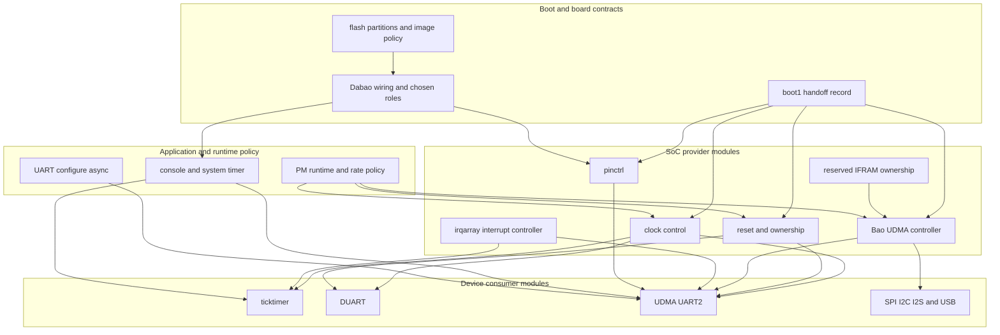

# Baochip Zephyr device creation architecture

## Decision

Reform device creation around domain-grouped, standard Zephyr provider and
consumer interfaces. Devicetree describes hardware and wiring. The SoC
integration layer maps Baochip identifiers and topology into Zephyr provider
interfaces. The board selects connected devices and roles. Drivers own device
mechanism. Kconfig and applications select operating policy.

The target is not a flat list of phandles and not a monolithic Bao resource
manager. Each shared hardware domain becomes a deep module at an existing
Zephyr seam:

- clock control reports fixed/input clocks and owns shared gates;
- reset control owns reset and boot-ownership transitions;
- DMA owns UDMA channels, descriptors, event routing, and completion;
- the interrupt controller owns irqarray interpretation and acknowledgment;
- pinctrl owns pin mux and electrical state;
- reserved-memory nodes declare static IFRAM ownership;
- ticktimer, DUART, and UDMA UART are consumers of those providers.

The depth comes from hiding register offsets, synchronization, ordering,
handoff, diagnostics, and fault accounting behind small standard interfaces.
That creates leverage across UART, SPI, I2C, timer, and later power management,
while preserving locality: a shared-gate race is fixed in one provider rather
than every consumer.

This document is a design and migration recommendation. It does not claim that
any proposed provider, binding, or test has been implemented.

## Why reform is required

At local Zephyr commit `9f1bb96cb066`, device creation still encodes several
implementation accidents as hardware description:

- UDMA UART2 maps four `reg` entries named `uart`, `tx_buffer`, `control`, and
  `irqarray`. Only `uart` is the UART register block. The other entries are
  memory ownership or other modules' registers masquerading as UART registers.
- The UART driver directly modifies the shared UDMA clock gate at
  `0x50100000`, directly disables and acknowledges irqarray5 events, and embeds
  UART2-specific masks despite using instance-generation macros.
- PB13/PB14 pinmux, UART setup, and DMA state are inherited from boot1 instead
  of represented as an explicit handoff and normal pinctrl/DMA configuration.
- Ticktimer uses a literal base-address assertion and literal flattened IRQ
  assertion. Those duplicate the DTS and interrupt encoding rather than test a
  semantic property.
- irqarray trigger masks were copied from Xous global policy. They are not
  expressed by each interrupt consumer and therefore cannot diagnose a wrong
  source mode locally.
- `CONFIG_NUM_IRQS=368`, the controller's flattened limit, and DT binding
  constants encode the same namespace in separate places.
- driver initialization uses loop counts as timeouts. A loop count changes its
  duration with CPU clock, optimization, and simulation speed.
- flash window, linker assertions, UF2 family policy, board documentation, and
  boot1 assumptions can drift because no generated consistency check ties
  their shared facts together.

These are interface problems, not merely missing helpers. Adding wrappers
around the existing cross-device reads would preserve a shallow design.

## Fact and policy taxonomy

Every value must have one authoritative locality. Generated checks may compare
two representations required by different build systems, but must not create a
third authority.

| Class | Meaning | Bao examples | Authoritative locality |
|---|---|---|---|
| Hardware fact | Fixed by RTL or package implementation | Register windows, irqarray bank/event topology, UDMA channel capabilities, divider field widths, IFRAM boundaries | SoC `.dtsi`, bindings, DT binding headers, provider implementation |
| SoC integration fact | How Bao hardware is represented to Zephyr | Clock/reset/DMA IDs, flattened IRQ encoding, direct-line set, provider relationships, legal DMA address domain | SoC `.dtsi` and `dt-bindings`; derived Kconfig only where Zephyr requires it |
| Board wiring fact | What Dabao connects and reserves | PB13 RX, PB14 TX, UART2 console, PC13 boot/USB role, installed memories | Board DTS and pinctrl groups |
| Driver policy | Mechanism choice internal to one driver | Polling strategy, lock granularity, descriptor layout, cache maintenance, retry and poll budgets, fault counters | Driver implementation and tests |
| Application policy | Product/workload choice | Console enabled, baud request, tickless mode, runtime PM enablement, desired performance state | Application DTS overlay, Kconfig, and runtime calls |

`current-speed` is a boot/default configuration request, not a hardware fact.
The ticktimer input rate is initially an adopted fixed-clock fact. Its derived
hardware-cycle and kernel-tick rates remain application policy constrained by
the accepted safety envelope.

## Target topology



The provider arrows are interfaces, not MMIO reachability. Consumers never map
provider registers. Reserved memory is declarative ownership rather than a
runtime provider call.

## Provider domains

### Clocks

Create Bao clock-control providers for fixed/input clocks and for the shared
clock domain containing the `0x50100000` UDMA gate. The gate adapter is a child
of one UDMA core module that owns the register block and lock together with the
reset and DMA adapters. Use named clock IDs from a Bao DT binding header.
Consumers receive `clocks` and `clock-names`, not `clock-frequency`, once the
provider is available.

Initial behavior is adopt-only:

- fixed/input clock adapters report the inherited frequency;
- `get_rate` and status are supported;
- a gate operation changes only the requested owned bit under the provider's
  lock;
- probe performs no whole-register initialization;
- PLL/divider rate changes return `-ENOTSUP` until coordinated transitions are
  designed.

The UDMA core's gate, reset, and DMA child adapters share an internal
register-update seam and lock. Consumers still see only their standard provider
interfaces and do not learn where the bits live.

### Reset and ownership

Create a reset-controller provider whose IDs name reset lines, not register
offsets. Its standard interface implements status, assert, and deassert only
where the hardware can safely support them. A global UDMA reset must not be
issued by a child probe.

Boot ownership is stricter than reset state. Keep the ownership state machine
inside the provider implementation:

```text
inherited -> adopted -> quiesced -> owned -> runtime-suspended
                 \-> handoff-failed
```

The public consumer interface remains standard reset and PM operations. The
provider obtains handoff facts from SoC/board integration and rejects unsafe
transitions. Do not invent a broad public `bao_claim_resource()` interface;
that would expose ordering and make every consumer understand boot cleanup.

### Bao UDMA controller

Model Bao UDMA as a Zephyr DMA controller, not merely as a clock/event helper.
This supersedes the narrower conclusion in the initial reform document. A UDMA
channel specifier identifies a hardware request endpoint and direction, for
example UART2 TX or UART2 RX. The DMA adapter owns:

- peripheral descriptor registers and their enable/clear protocol;
- source/destination address and length validation;
- event routing and irqarray completion association;
- start, stop, status, and callback ordering;
- the required clock/reset acquisition;
- IFRAM eligibility and cache maintenance rules;
- bounded quiesce based on an elapsed-time deadline;
- fault counters and last-failure context.

The first implementation may honestly support a subset of Zephyr's DMA
interface: one block, fixed peripheral endpoint, no scatter/gather, no cyclic
mode, and only supported widths. Unsupported configurations return `-ENOTSUP`.
It must still satisfy the documented semantics of `dma_config()`,
`dma_start()`, `dma_stop()`, and `dma_get_status()` before UART migrates.

Do not make the DMA provider allocate arbitrary IFRAM. A consumer buffer must
either be in a referenced reserved region or pass the controller's legal-address
and coherency validation. Static console buffers remain board-owned reservations
until a general DMA-safe allocator is demonstrated by multiple consumers.

### Interrupt controller

The irqarray provider owns physical-bank reordering, MIM/MIP CSR access,
trigger/polarity programming, enable state, pending acknowledgment, and direct
line semantics. Interrupt specifiers should carry semantic trigger flags for
bank events. Direct lines either accept only their fixed legal flags or use a
distinct macro that makes the absence of irqarray policy explicit.

Replace controller-wide `edge-triggered-masks` and `rising-edge-masks` with
consumer-local interrupt flags only as one complete change: binding cells,
translation, generated validation, init ordering, dispatch behavior, and tests.
The provider configures a source while disabled, clears stale pending state,
then enables it. Edge sources are pre-acknowledged; level sources are
deasserted by their owner before post-ack, as proven in the interrupt audit.

Derive the maximum flattened IRQ from shared binding constants. Keep the Kconfig
default only if Zephyr requires `NUM_IRQS` before generated DT is usable, and add
a build assertion that it equals the shared derived limit. There must be one
formula, not three independent literals.

### Pinctrl

Create an IOX pinctrl provider with named pin/function constants. Pinctrl states
describe mux and electrical wiring; they do not describe boot cleanup. Applying
a state changes only its pins and preserves unrelated fields. PB13/PB14 belong
to the Dabao UART2 default/sleep states. PC13 remains reserved for the boot/USB
handoff until a USB owner explicitly takes it.

If GPIO later shares IOX registers, pinctrl and GPIO use one internal per-pin
locking implementation. That internal seam deepens both modules without
creating a public cross-provider lock interface.

### Reserved memory and IFRAM

Represent IFRAM banks in the SoC DTS and board/application allocations under
`/reserved-memory`. Consumers use `memory-regions` and `memory-region-names`
references. Build validation checks alignment, containment, non-overlap, and
any uncached requirement.

Ownership must include regions retained by boot1 or USB even when Zephyr has no
consumer for them. Unknown ownership defaults to reserved, not free. The final
UART2 TX/RX area is no longer a `reg` tuple on the UART.

## Consumer domains

### Ticktimer

The ticktimer consumes `clocks` and its direct `interrupts` entry. Preserve the
accepted configurable-rate interface and conservative software-only envelope
from [`09-ticktimer-config-adjudication.md`](09-ticktimer-config-adjudication.md).
Do not convert the accepted fixed boot-time input into runtime clock mutability.

Delete literal address and flattened-IRQ equality assertions. Replace them with
semantic assertions: compatible chosen node, sufficient register window,
exact-rate and safety-envelope constraints, a legal direct interrupt, and no
runtime update. Poll bounds remain private implementation constants derived
from hardware periods; failures expose phase and elapsed/budget information.

### DUART

DUART consumes a clock and reset if those controls exist in hardware. It remains
an honest TX-only UART adapter: `poll_in` reports no data, unsupported configure
requests return `-ENOTSUP`, and capabilities are documented. It must not claim
board console status merely because Verilator uses it. The simulation board or
overlay chooses DUART as console.

Add `configure` and `config_get` only for combinations the hardware and driver
can represent. If ETUC can change safely only across disable/enable, the driver
owns that sequence under its lock; callers see only the standard UART interface.

### UDMA UART2 and other UART instances

Each UDMA UART node has one UART `reg` region and standard provider properties:
`clocks`, `resets`, `dmas`, `dma-names`, `memory-regions`,
`memory-region-names`, `interrupts`, and `pinctrl-*`. UART2 is a board role, not
a driver special case.

Migration order inside the UART module is:

1. polling TX/RX with standard `configure` and `config_get`;
2. interrupt-driven behavior only if it adds a real supported mode rather than
   duplicating DMA completion callbacks;
3. async TX using the DMA provider and standard timeout semantics;
4. async RX with caller buffers, replacement-buffer events, abort, and precise
   ownership transitions;
5. optional runtime PM once suspend/resume preserves console and DMA invariants.

The driver must report unsupported parity, stop bits, data bits, flow control,
or rates instead of silently coercing them to the current 8-N-1 setup literal.
The setup-register encoding remains private.

### PM and rate policy

Runtime PM is application policy enabled through standard Zephyr controls. A
consumer runtime-suspends only after its DMA channels are stopped and its source
is quiesced. Providers reference-count gates and preserve boot-owned users.

No runtime clock-rate policy is approved for ticktimer or UART in this pass.
Future rate transitions require a provider protocol that validates all active
consumers, quiesces them, changes the rate, reconfigures divisors, and rolls back
or fails atomically. A notifier chain without two real rate-changing consumers
would be speculative and shallow.

## Board and boot locality

### Chosen nodes and wiring

The Dabao board DTS selects `zephyr,console`, `zephyr,system-timer`,
`zephyr,flash`, and `zephyr,sram`. The SoC DTS declares available devices but
does not choose board roles. PB13/PB14 wiring and UART2 pinctrl states live in
the board DTS or board pinctrl file. Simulation selects DUART in its own board or
overlay rather than modifying the SoC default.

### Boot1 handoff contract

Record the boot1 contract as explicit preconditions and provider postconditions:

| Domain | Entry fact | Required adoption behavior |
|---|---|---|
| CPU/clocks | Boot1 selected root rates | Observe; do not reprogram globally |
| UART2 | PB13/PB14, UART setup, and DMA may be live | Quiesce only UART2; preserve first Zephyr output |
| UDMA | Shared gate, routes, and descriptors may contain inherited state | Preserve unrelated bits and channels |
| Interrupts | CPU and bank masks/pending may contain boot state | Disable locally, classify source, clear safely, then enable |
| IFRAM | Boot1/USB regions may remain meaningful | Do not overwrite unassigned memory |
| PC13 | Used for PROG and USB SE0/disconnect | Preserve until explicit USB handoff |

Boot cleanup order, scratch addresses, and individual writes are provider
implementation. The contract states observable preconditions, ownership
transitions, postconditions, and failure behavior.

### Flash, linker, and UF2

Separate three kinds of policy:

- SoC/boot ABI facts: baremetal entry alignment, signature trampoline, and boot1
  accepted address envelope;
- board storage layout: fixed partitions and which partition is chosen as
  `zephyr,code-partition` or flash;
- image/delivery policy: UF2 family ID and runner selection.

Represent the code window as a fixed partition where Zephyr's flash model can
support it, and derive linker placement from the chosen code partition. Keep a
link assertion for the boot1 first-byte ABI, but generate its address from DT
rather than repeat `0x60060400`. Generate or validate UF2 family metadata from
one Bao constant. A build-time board validation helper must fail when DTS
partition, linker region, signed-image tool metadata, UF2 family, or board docs
disagree.

## Target DTS sketch

This sketch illustrates interface shape, not final compatible names or numeric
IDs.

```dts
#include <zephyr/dt-bindings/clock/baochip-bao1x-clock.h>
#include <zephyr/dt-bindings/reset/baochip-bao1x-reset.h>
#include <zephyr/dt-bindings/dma/baochip-bao1x-udma.h>
#include <zephyr/dt-bindings/interrupt-controller/baochip-bao1x-intc.h>
#include <zephyr/dt-bindings/pinctrl/baochip-bao1x-pinctrl.h>

/ {
    reserved-memory {
        #address-cells = <1>;
        #size-cells = <1>;
        ranges;

        unassigned_ifram: memory@50000000 {
            reg = <0x50000000 0x0001f000>;
            no-map;
        };

        uart2_dma: memory@5001f000 {
            compatible = "zephyr,memory-region";
            reg = <0x5001f000 0x00001000>;
            zephyr,memory-region = "UART2_DMA";
            no-map;
        };
    };
};

soc {
    clocks: clock-controller@40040000 {
        compatible = "baochip,bao1x-clock";
        reg = <0x40040000 0x1000>;
        #clock-cells = <1>;
    };

    udma_core: udma@50100000 {
        compatible = "baochip,bao1x-udma-core";
        reg = <0x50100000 0x1000>;
        clocks = <&clocks BAO1X_CLK_UDMA>;
        interrupt-parent = <&intc>;

        udma_clocks: clock-controller {
            compatible = "baochip,bao1x-udma-clock";
            #clock-cells = <1>;
        };

        udma_resets: reset-controller {
            compatible = "baochip,bao1x-udma-reset";
            #reset-cells = <1>;
        };

        udma: dma-controller {
            compatible = "baochip,bao1x-udma";
            #dma-cells = <2>; /* request, direction */
            dma-controller;
            dma-channels = <32>;
        };
    };

    ticktimer: timer@e001b000 {
        compatible = "baochip,bao1x-ticktimer";
        reg = <0xe001b000 0x24>;
        clocks = <&clocks BAO1X_CLK_TICKTIMER_INPUT>;
        interrupts = <BAO1X_IRQ_DIRECT(20) IRQ_TYPE_LEVEL_HIGH>;
    };

    uart2: serial@50103000 {
        compatible = "baochip,bao1x-udma-uart";
        reg = <0x50103000 0x38>;
        clocks = <&udma_clocks BAO1X_CLK_UDMA_UART2>;
        resets = <&udma_resets BAO1X_RESET_UDMA_UART2>;
        dmas = <&udma BAO1X_UDMA_REQ_UART2_TX DMA_MEMORY_TO_PERIPHERAL>,
               <&udma BAO1X_UDMA_REQ_UART2_RX DMA_PERIPHERAL_TO_MEMORY>;
        dma-names = "tx", "rx";
        memory-regions = <&uart2_dma>;
        memory-region-names = "dma";
        interrupts = <BAO1X_IRQ_EVENT(5, 8) IRQ_TYPE_EDGE_RISING>,
                     <BAO1X_IRQ_EVENT(5, 9) IRQ_TYPE_EDGE_RISING>;
        interrupt-names = "rx", "tx";
        pinctrl-0 = <&uart2_default>;
        pinctrl-1 = <&uart2_sleep>;
        pinctrl-names = "default", "sleep";
        current-speed = <1000000>;
        status = "disabled";
    };
};
```

The exact UART event IDs must be verified against RTL/SVD before implementation;
the sketch intentionally does not bless the current broad `GENMASK(11, 8)` as
the UART interface.

## Binding and interface sketches

```yaml
# baochip,bao1x-udma.yaml
compatible: "baochip,bao1x-udma"
include: dma-controller.yaml
properties:
  "#dma-cells": { const: 2 }
dma-cells:
  - request
  - direction
```

```yaml
# baochip,bao1x-udma-uart.yaml
compatible: "baochip,bao1x-udma-uart"
include:
  - uart-controller.yaml
  - pinctrl-device.yaml
  - reset-device.yaml
  - memory-region.yaml
properties:
  reg: { required: true }
  clocks: { required: true }
  resets: { required: true }
  dmas: { required: true }
  dma-names: { required: true }
  memory-regions: { required: true }
  memory-region-names: { required: true }
  interrupts: { required: true }
  interrupt-names: { required: true }
```

The binding should constrain names to `tx`/`rx`, require one UART register
range, and reject legacy `tx_buffer`, `control`, and `irqarray` register names.

Provider implementation interfaces remain standard Zephyr calls. Bao-specific
headers contain IDs and generated-spec convenience only:

```c
/* Public: stable topology names, no offsets. */
#define BAO1X_CLK_UDMA_UART2 ...
#define BAO1X_RESET_UDMA_UART2 ...
#define BAO1X_UDMA_REQ_UART2_TX ...
#define BAO1X_IRQ_UART2_TX BAO1X_IRQ_EVENT(5, ...)

/* Private to provider implementation and tests. */
struct baochip_mmio_ops;
struct baochip_fault_snapshot;
```

The fake-MMIO seam is private. Production drivers use normal MMIO; provider
unit tests inject a second adapter that records reads, writes, barriers, and
elapsed time. This is a real seam because it has production and test adapters,
but exposing it to consumers would make the interface shallow.

## What must not be exposed

The following are implementation, never DTS properties, public provider IDs,
or consumer parameters:

- raw register offsets or cross-device MMIO addresses;
- UART setup-register literals such as `0x0316`;
- retry counts, poll-loop counts, or poll budgets;
- register write/reorder sequences and fence placement;
- cache assumptions such as “IFRAM is uncached” without a memory attribute or
  DMA capability check;
- scratch-buffer addresses or “final IFRAM page” conventions;
- boot cleanup sequence, stale-state clearing recipe, or ownership step order.

Expose outcomes instead: supported configurations, timeout units, address and
alignment constraints, ownership state, error codes, and fault observations.

## Helpers and diagnostics

| Proposal | Depth assessment | Decision |
|---|---|---|
| Named clock/reset/DMA/IRQ/pin constants in DT binding headers | Deepens interfaces by replacing magic topology with stable semantic names | Build now |
| Binding macros that derive channel/IRQ limits from one formula | Removes duplicated `NUM_IRQS` and instance arithmetic while improving diagnostics | Build now |
| Generated DTS/linker/UF2 consistency checks | Concentrates metadata drift detection at the build seam | Build now |
| Reusable private fake-MMIO adapter with scripted time | Exercises provider interfaces, ordering, races, and timeout behavior without exposing registers to consumers | Build now |
| Provider fault snapshot and counters | Makes bounded failures observable without logging from tight/early paths | Build now, small fixed schema |
| Board validation helper for chosen nodes, partitions, pins, and reservations | Gives high leverage across overlays and catches wiring/ownership mistakes | Build now |
| Generic shared-register update primitive | Useful only inside clock/reset/IOX implementations; public use would leak register semantics | Keep private |
| General UDMA descriptor builder | Potentially deep after UART and a second protocol adapter agree on semantics | Defer |
| Generic IFRAM allocator | No demonstrated dynamic ownership contract and dangerous during boot/USB handoff | Defer |
| Universal Bao resource graph or ownership DSL | Duplicates Zephyr providers and exposes sequencing | Reject as shallow |
| Dynamic clock notifier framework | One fixed-rate deployment and no safe transition protocol | Reject as speculative now |

Build diagnostics should name the consumer, provider, semantic identifier, and
violated invariant. Examples:

```text
uart2: DMA region uart2_dma overlaps boot-owned IFRAM
uart2: TX DMA request is not memory-to-peripheral
ticktimer: interrupt must be a legal Bao direct line
bao1x-intc: CONFIG_NUM_IRQS=368 does not match derived IRQ limit 368
dabao: chosen code partition start differs from boot1 entry contract
uart2: requested 115200 7E1 is not representable by Bao UDMA UART
```

Runtime timeout diagnostics use elapsed time or hardware cycles plus operation
name, never only loop iterations. Early-boot modules retain counters even when
logging is unavailable. At minimum record quiesce timeout, DMA bus/address
fault, unexpected irqarray source, unsupported UART configuration, and handoff
failure.

## Decision records

### DR-1: Standard providers over a Bao resource manager

**Accepted.** Standard seams maximize reuse and upstream comprehensibility.
Shared-register coordination stays in provider implementations.

### DR-2: UDMA is a DMA controller

**Accepted with conformance gate.** Implement the supported subset of the
standard DMA interface and reject unsupported modes. Do not migrate UART merely
after creating a binding; first prove configure/start/stop/status and callback
semantics through provider tests.

### DR-3: Static IFRAM ownership before allocation

**Accepted.** Reserved-memory metadata and explicit references precede any
allocator. Unknown boot/USB regions stay reserved.

### DR-4: Adopt-only clocks and resets first

**Accepted.** Probe observes inherited configuration. Narrow gate/reset changes
occur only for an explicitly owned child. Runtime rate changes remain rejected.

### DR-5: Consumer-local interrupt semantics

**Accepted.** Move copied global masks to interrupt specifiers only with full
controller support and generated equivalence checks.

### DR-6: Boot ABI and delivery metadata have separate locality

**Accepted.** DT partitions describe storage, linker checks the selected code
region and entry ABI, and UF2 tooling owns delivery format. Build validation
connects them without collapsing them into one bespoke metadata file.

## Open questions

1. Which exact UDMA UART events correspond to RX completion, TX completion,
   error, and validity, and which are edge versus level in RTL?
2. Can all supported UDMA channels satisfy Zephyr `dma_stop()` without a global
   reset, including inherited busy descriptors?
3. Does hardware distinguish peripheral reset lines, or must UART ownership be
   implemented without reset while the global UDMA reset remains unavailable?
4. Which IFRAM ranges remain live or security-sensitive after boot1 jumps, and
   when does USB relinquish each range?
5. Are PB13/PB14 electrical settings fully represented in IOX data, and what
   sleep state preserves recovery and avoids line glitches?
6. Should console polling use a statically reserved DMA byte indefinitely, or
   transition to the same queued async path after kernel initialization?
7. Can `CONFIG_NUM_IRQS` be derived from generated DT at its Kconfig evaluation
   point, or is a shared-header equality check the least duplicated solution?
8. Which Zephyr fixed-partition/chosen-code-partition shape works with the
   memory-mapped RRAM model without falsely claiming a writable flash driver?
9. What fault status exists for UDMA invalid addresses, and can it identify the
   failing channel without destructive reads?

## Tracer sequence

The sequence is phased by dependency and review locality, not estimated time.
Each tracer must build independently, preserve current console/timer behavior,
and include the acceptance evidence listed here.

| ID | Domain tracer | Acceptance | Depends on |
|---|---|---|---|
| T0 | Contract fixtures | Native fixtures express boot state, shared-gate preservation, IRQ modes, IFRAM map, and current generated metadata without changing production behavior | none |
| T1 | Shared identifiers and validation | Named line/clock/reset/DMA/pin constants compile; one derived IRQ-limit formula is checked against `NUM_IRQS`; current DTS/linker/UF2 values pass drift checks | T0 |
| T2 | Clock provider | Fixed/input rates and shared UDMA gates use clock control; probe writes nothing; concurrent gate users preserve each other; ticktimer and DUART can consume clocks | T1 |
| T3 | Reset/ownership provider | Adopt/quiesce/own failure states are tested; child operations never issue global UDMA reset; boot-owned state is preserved | T1 |
| T4 | IFRAM ownership | SoC banks and board reservations validate containment/non-overlap; boot/USB unknown ranges remain reserved; no UART binding change yet | T1 |
| T5 | UDMA provider core | Standard DMA subset passes fake-MMIO configure/start/stop/status, invalid-address, busy handoff, timeout, and unrelated-bit tests | T2, T3, T4 |
| T6 | irqarray semantic specifiers | Two-cell interrupts, direct-line validation, generated old-mask equivalence, edge/level race tests, and no consumer direct MMIO | T1 |
| T7 | IOX pinctrl and Dabao states | PB13/PB14 default/sleep states apply without touching PC13 or adjacent pins; board validation catches conflicts | T1, T3 |
| T8 | Ticktimer/DUART cleanup | Both consume clocks; literal address/IRQ assertions are gone; accepted timer envelope remains; DUART config_get is honest | T2, T6 |
| T9 | UART2 polling migration | UART has one `reg`; consumes clock/reset/DMA/memory/interrupt/pinctrl; first and normal console bytes survive; no raw irqarray/shared-gate access remains | T5, T6, T7 |
| T10 | UART standard configuration | `configure`/`config_get` round-trip supported formats/rates and reject unsupported ones; setup literal remains private | T9 |
| T11 | UART async TX/RX | DMA callbacks, timeouts, aborts, buffer ownership, and interrupt ordering satisfy standard UART async events | T10 |
| T12 | Runtime PM adoption | Suspend/resume quiesces DMA, applies pin states, reference-counts gates, and preserves chosen-console policy; runtime rate change remains rejected | T11 |
| T13 | Flash/boot metadata locality | Fixed partition, linker entry, signer input, UF2 family, and board documentation have one authority each and generated consistency checks | T1 |
| T14 | Hardware handoff validation | Dabao evidence records first-byte continuity, PB13/PB14 state, PC13 preservation, adjacent IFRAM canaries, unrelated UDMA state, timer cadence, and recoverability | T8, T9, T13 |

Dependency edges are explicit: `T5` depends on `T2/T3/T4`; `T9` depends on
`T5/T6/T7`; `T11` depends on `T10`; `T14` depends on `T8/T9/T13`. A provider
binding without provider behavior does not unblock its consumer.

## Recommended next implementation pass

The next pass should stop before UART2 production migration. It is sized for
several agents working at domain seams with little file overlap.

| Priority | Agent lane | Deliverable | Integration gate |
|---:|---|---|---|
| 1 | Contract and diagnostics | T0 fixtures plus private fake-MMIO/time adapter and fault snapshot conventions | Existing behavior represented; no production path changed |
| 2 | Identifiers and metadata | T1 named constants, IRQ-limit derivation, DTS/linker/UF2 drift checks | Pristine positive and intentionally broken negative builds |
| 3 | Clock/reset | T2 and T3 provider bindings, adopt-only implementations, shared-register and ownership tests | Probe-write trace empty; unrelated bits preserved |
| 4 | Memory | T4 IFRAM inventory, reserved-memory nodes, overlap/containment validation | Current boot/USB ranges conservative and UART reservation explicit |
| 5 | Interrupts | T6 semantic specifier prototype and old-mask equivalence tests | RTL-derived edge/level tests pass; no consumer migration yet |
| 6 | Pinctrl | T7 IOX provider seam and Dabao PB13/PB14 states | PC13 and neighboring pins unchanged in scripted and hardware snapshots |
| 7 | UDMA | T5 standard DMA subset on fake MMIO, initially not selected by UART | DMA conformance subset and inherited-busy failure behavior pass |
| 8 | Synthesis/integration | Reconcile provider IDs, init dependencies, diagnostics, and DTS sketch; prepare T8/T9 implementation brief | All providers coexist in a build with legacy UART still operational |

Do not parallelize UART migration with an unproven DMA provider. Agents may
develop fixtures and bindings concurrently, but T9 starts only after the
integration gate proves the final provider interfaces.

## Recommended entry points

1. Start with [`08-device-creation-reform.md`](08-device-creation-reform.md) for
   the original audit and ownership hazards.
2. Read [`09-ticktimer-config-adjudication.md`](09-ticktimer-config-adjudication.md)
   before changing timer clocks, takeover, or timeout bounds.
3. Inspect current `bao1x.dtsi`, `uart_baochip_udma.c`, and the UDMA UART binding
   together; their coupling is the first concrete seam to remove.
4. Implement T0/T1 before selecting provider compatible names or changing DTS.
5. Use the provider-domain lanes above, then integrate at T5/T6/T7 before T9.

## Cross-references

- [`/.design/research/08-device-creation-reform.md`](/.design/research/08-device-creation-reform.md) is the completed initial audit and establishes adopt-only ownership, static IFRAM, pin preservation, and the rejection of raw provider-register phandles. This design broadens it and supersedes its conclusion that UDMA common control should not become a DMA controller.
- [`/.design/research/09-ticktimer-config-adjudication.md`](/.design/research/09-ticktimer-config-adjudication.md) defines the accepted fixed-input configurable-rate envelope, two-reset takeover proof, and derived bounded polling that the clock migration must preserve.
- [`/.design/research/06-irq-ack-semantics.md`](/.design/research/06-irq-ack-semantics.md) supplies the RTL-proven edge pre-ack, level post-ack, direct-line bypass, and race tests required by T6.
- [`/.design/research/05-lifecycle-delivery-validation.md`](/.design/research/05-lifecycle-delivery-validation.md) distinguishes observed boot/hardware evidence from inferred ownership and defines device recovery constraints.
- [`/.design/research/01-boot-delivery.md`](/.design/research/01-boot-delivery.md) records the boot1 entry contract, signed image shape, baremetal address envelope, and UF2 constants used by T13.
- [`/.design/research/00-soc-inventory.md`](/.design/research/00-soc-inventory.md) is the hardware inventory for clock, UDMA, IFRAM, IOX, UART2, interrupt, and memory facts that proposed IDs must trace back to.
- [`/doc/bringup/manual-validation.md`](/doc/bringup/manual-validation.md) is the downstream operator procedure that T14 must extend only after implementation exists.
- [`Zephyr DMA interface`](https://github.com/zephyrproject-rtos/zephyr/blob/main/include/zephyr/drivers/dma.h) is the primary consumer/provider contract the Bao UDMA adapter must satisfy rather than imitate.
- [`Zephyr DMA controller binding`](https://github.com/zephyrproject-rtos/zephyr/blob/main/dts/bindings/dma/dma-controller.yaml) defines standard channel, request, mask, and alignment metadata.
- [`Zephyr UART interface`](https://github.com/zephyrproject-rtos/zephyr/blob/main/include/zephyr/drivers/uart.h) defines configuration, polling, interrupt, and async buffer/event semantics for the staged UART evolution.
- [`Zephyr clock-control interface`](https://github.com/zephyrproject-rtos/zephyr/blob/main/include/zephyr/drivers/clock_control.h) and [`clock controller binding`](https://github.com/zephyrproject-rtos/zephyr/blob/main/dts/bindings/clock/clock-controller.yaml) define the standard clock seam.
- [`Zephyr reset interface`](https://github.com/zephyrproject-rtos/zephyr/blob/main/include/zephyr/drivers/reset.h) and [`reset controller binding`](https://github.com/zephyrproject-rtos/zephyr/blob/main/dts/bindings/reset/reset-controller.yaml) define the narrow reset seam; Bao ownership sequencing remains behind it.
- [`Zephyr pinctrl interface`](https://github.com/zephyrproject-rtos/zephyr/blob/main/include/zephyr/drivers/pinctrl.h) and [`pinctrl binding`](https://github.com/zephyrproject-rtos/zephyr/blob/main/dts/bindings/pinctrl/pinctrl-device.yaml) define consumer states without exposing IOX registers.
- [`Xous Bao UDMA implementation`](https://github.com/betrusted-io/xous-core/blob/5d5bbbfa95c0dcef26fe1fe9b496b7f6f31d191b/libs/bao1x-hal/src/udma/mod.rs#L46-L160) is primary integration evidence for shared gate, reset, and event routing behavior, not a Zephyr interface precedent.
- [`Xous UDMA UART implementation`](https://github.com/betrusted-io/xous-core/blob/5d5bbbfa95c0dcef26fe1fe9b496b7f6f31d191b/libs/bao1x-hal/src/udma/uart.rs) is primary evidence for descriptor and setup behavior that must be verified against RTL before assigning standard DMA capabilities.

## Doc-pass record

The documentation tree was searched by provider, ownership, boot handoff,
interrupt semantics, timer configuration, console, flash, linker, and UF2
concepts. The substantive relationships are linked above. The initial reform
document remains useful as the audit record; this design is the broader target
entry point. The research README is updated only to route readers to both and
to identify this document as the follow-up architecture.

Notable absences remain explicit open work: there is no accepted IFRAM ownership
map after boot1, no UDMA DMA-interface conformance proof, no IOX pinctrl design,
and no single generated source for boot partition/linker/UF2 consistency. Those
absences are not implementation claims and should not be papered over by DTS
properties.
